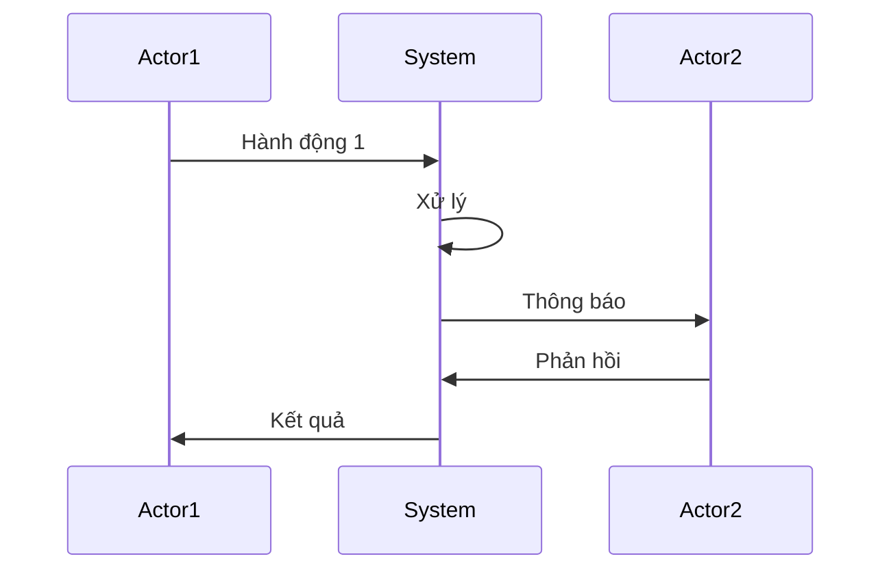
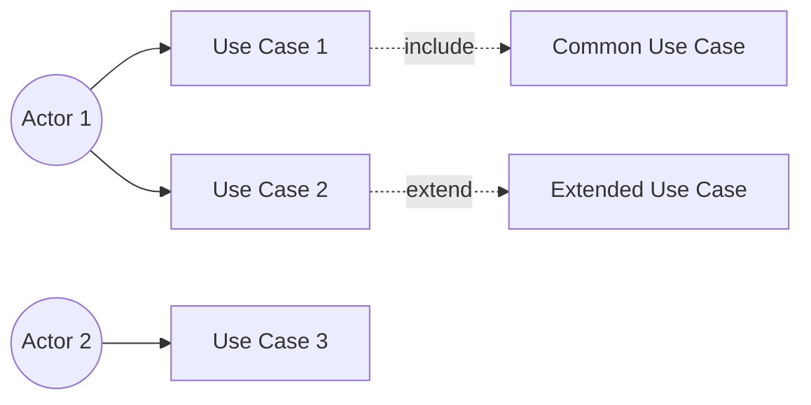

Bạn là một Business Analyst và System Architect chuyên nghiệp. Hãy phân tích hệ thống và tạo:
1. Business Flow Diagram (Sơ đồ luồng nghiệp vụ)
2. Use Case Diagram (Sơ đồ tình huống sử dụng)
3. Chi tiết Use Cases
4. Mapping với Logic Code

Để giúp team development hiểu rõ luồng nghiệp vụ và implement chính xác.

### Thông tin hệ thống:

**Tên hệ thống:**
[Tên hệ thống/dự án của bạn]

**Mô tả hệ thống:**
[Mô tả ngắn gọn hệ thống làm gì, phục vụ ai]

**Các Actors (Người dùng/Vai trò):**
[Liệt kê các vai trò trong hệ thống]
Ví dụ:
- Student (Sinh viên)
- Teacher (Giáo viên)
- Academic Staff (Nhân viên học vụ)
- Admin (Quản trị viên)

**Các nghiệp vụ chính:**
[Mô tả các luồng nghiệp vụ chính]
Ví dụ:
1. Đăng ký khóa học
2. Quản lý lớp học
3. Chấm điểm và feedback
4. Thanh toán học phí

**Luồng tương tác giữa các actors:**
[Mô tả cách các vai trò tương tác với nhau]
Ví dụ:
- Student đăng ký khóa học → Academic Staff duyệt → Teacher nhận lớp → Student học → Teacher chấm điểm → Student nhận feedback

**Business Rules:**
[Các quy tắc nghiệp vụ quan trọng]
Ví dụ:
- Sinh viên phải đóng học phí trước khi đăng ký
- Một lớp tối đa 30 sinh viên
- Giáo viên chỉ có thể dạy tối đa 5 lớp/kỳ

**Các trạng thái quan trọng:**
[Các trạng thái của đối tượng chính trong hệ thống]
Ví dụ:
- Đơn đăng ký: Pending → Approved → Active → Completed
- Lớp học: Draft → Open → In Progress → Closed

---

### Yêu cầu Output:

## 📊 BUSINESS FLOW & USE CASE ANALYSIS

### 1. TỔNG QUAN HỆ THỐNG

#### 1.1 System Context
- Tên hệ thống và mục đích
- Scope và boundaries
- Key stakeholders

#### 1.2 Actors (Các Vai trò)
Liệt kê tất cả actors với:

| Actor | Mô tả | Responsibilities | System Access Level |
|-------|-------|------------------|-------------------|
| [Actor 1] | ... | ... | ... |
| [Actor 2] | ... | ... | ... |

### 2. BUSINESS FLOW DIAGRAMS

#### 2.1 High-Level Business Flow
```
Vẽ sơ đồ tổng quan luồng nghiệp vụ chính sử dụng Mermaid diagram:

graph TB
    Start[Bắt đầu] --> Step1[Bước 1]
    Step1 --> Decision{Điều kiện?}
    Decision -->|Yes| Step2[Bước 2]
    Decision -->|No| Step3[Bước 3]
    Step2 --> End[Kết thúc]
    Step3 --> End
```

#### 2.2 Detailed Business Flows
Tạo sơ đồ chi tiết cho từng nghiệp vụ chính:

##### 📌 Flow 1: [Tên nghiệp vụ]


**Mô tả chi tiết:**
1. **Bước 1:** [Actor] thực hiện [action]
   - Input: [data]
   - Validation: [rules]
   - Business logic: [logic]

2. **Bước 2:** System xử lý
   - Process: [process name]
   - Rules applied: [rules]
   - State change: [from] → [to]

3. **Bước 3:** [Actor] nhận kết quả
   - Output: [data]
   - Notification: [notification type]
   - Next actions: [possible actions]

**Business Rules:**
- Rule 1: [description]
- Rule 2: [description]

**Error Handling:**
- Error case 1: [handling]
- Error case 2: [handling]

**State Transitions:**
```
[Initial State] → [Action] → [Next State]
```

### 3. USE CASE DIAGRAM

#### 3.1 Overall Use Case Diagram


#### 3.2 Use Cases by Actor

##### 👤 [Actor 1]
- UC-001: [Use case name]
- UC-002: [Use case name]
- UC-003: [Use case name]

##### 👤 [Actor 2]
- UC-004: [Use case name]
- UC-005: [Use case name]

### 4. CHI TIẾT USE CASES

#### Use Case Template:

---

#### **UC-001: [Tên Use Case]**

**Mô tả:** [Mô tả ngắn gọn use case này làm gì]

**Actor:** [Primary Actor]

**Điều kiện tiên quyết (Preconditions):**
- Precondition 1
- Precondition 2

**Điều kiện sau (Postconditions):**
- Postcondition 1
- Postcondition 2

**Luồng chính (Main Flow):**
1. Actor [action]
2. System [validates/processes]
3. System [displays/saves]
4. Actor [next action]
5. Use case ends

**Luồng thay thế (Alternative Flows):**

**Alt-1:** [Tên luồng thay thế]
- 2a. If [condition]
  - 2a.1. System [action]
  - 2a.2. Return to step 3

**Alt-2:** [Tên luồng thay thế]
- 3a. If [condition]
  - 3a.1. System [action]
  - Use case ends

**Luồng ngoại lệ (Exception Flows):**

**Exc-1:** [Validation Error]
- At step 2: If [error condition]
  - System displays error message
  - Return to step 1

**Exc-2:** [System Error]
- At any step: If system error occurs
  - System logs error
  - System displays generic error message
  - Use case ends

**Business Rules:**
- BR-001: [Rule description]
- BR-002: [Rule description]

**Non-functional Requirements:**
- Performance: [requirement]
- Security: [requirement]
- Usability: [requirement]

**UI/UX Notes:**
- [Note about interface]
- [Note about user experience]

**Data Elements:**

| Data Field | Type | Required | Validation Rules |
|------------|------|----------|------------------|
| Field 1 | String | Yes | Max 50 chars |
| Field 2 | Number | No | Min: 0, Max: 100 |

**Related Use Cases:**
- Includes: UC-XXX
- Extends: UC-YYY
- Follows: UC-ZZZ

---

### 5. MAPPING VỚI LOGIC CODE

#### 5.1 System Architecture Overview
```
Mô tả kiến trúc hệ thống và các layers:

┌─────────────────────────────────────┐
│     Presentation Layer (UI)         │
├─────────────────────────────────────┤
│     Application Layer (Services)    │
├─────────────────────────────────────┤
│     Domain Layer (Business Logic)   │
├─────────────────────────────────────┤
│     Data Access Layer (Repository)  │
├─────────────────────────────────────┤
│     Database                        │
└─────────────────────────────────────┘
```

#### 5.2 Use Case to Code Mapping

##### **UC-001: [Use Case Name] → Code Implementation**

**Controller/API Endpoint:**
```typescript
// API: POST /api/[resource]/[action]
// Description: [What this endpoint does]

@Post('[endpoint]')
async handleAction(@Body() dto: ActionDto): Promise<Response> {
  // Map to service layer
}
```

**Service Layer:**
```typescript
// Service: [ServiceName]
// Method: [methodName]
// Business logic for UC-001

class ServiceName {
  async methodName(data: InputDto): Promise<OutputDto> {
    // Step 1: Validate input (Main Flow - Step 2)
    // Step 2: Apply business rules (BR-001, BR-002)
    // Step 3: Process data (Main Flow - Step 3)
    // Step 4: Save to database
    // Step 5: Return result
  }
}
```

**Domain Models:**
```typescript
// Entity: [EntityName]
// Represents: [Domain concept]

class EntityName {
  // Properties matching Data Elements
  id: string;
  field1: string;
  field2: number;
  status: StatusEnum;
  
  // Business methods
  validateBusinessRules(): boolean {
    // Implement BR-001, BR-002
  }
  
  changeState(newState: StatusEnum): void {
    // Handle state transitions
  }
}
```

**Repository/Data Access:**
```typescript
// Repository: [RepositoryName]
// Data persistence for [Entity]

interface IRepository {
  create(data: CreateDto): Promise<Entity>;
  findById(id: string): Promise<Entity>;
  update(id: string, data: UpdateDto): Promise<Entity>;
  delete(id: string): Promise<void>;
}
```

**DTOs (Data Transfer Objects):**
```typescript
// Input DTO for UC-001
class ActionDto {
  @IsString()
  @MaxLength(50)
  field1: string;
  
  @IsNumber()
  @Min(0)
  @Max(100)
  field2: number;
}

// Output DTO
class ActionResponseDto {
  success: boolean;
  data: EntityDto;
  message: string;
}
```

**State Management:**
```typescript
// Status Enum for state transitions
enum StatusEnum {
  PENDING = 'pending',
  APPROVED = 'approved',
  ACTIVE = 'active',
  COMPLETED = 'completed',
  REJECTED = 'rejected'
}

// State machine
const stateTransitions = {
  [StatusEnum.PENDING]: [StatusEnum.APPROVED, StatusEnum.REJECTED],
  [StatusEnum.APPROVED]: [StatusEnum.ACTIVE],
  [StatusEnum.ACTIVE]: [StatusEnum.COMPLETED],
  // ...
};
```

**Error Handling:**
```typescript
// Custom exceptions for Exception Flows
class ValidationException extends Error {
  constructor(message: string) {
    super(message);
    this.name = 'ValidationException';
  }
}

class BusinessRuleException extends Error {
  constructor(rule: string, message: string) {
    super(message);
    this.name = 'BusinessRuleException';
  }
}
```

#### 5.3 Database Schema

```sql
-- Table for main entity
CREATE TABLE entity_name (
    id UUID PRIMARY KEY,
    field1 VARCHAR(50) NOT NULL,
    field2 INTEGER CHECK (field2 >= 0 AND field2 <= 100),
    status VARCHAR(20) NOT NULL,
    created_at TIMESTAMP DEFAULT CURRENT_TIMESTAMP,
    updated_at TIMESTAMP DEFAULT CURRENT_TIMESTAMP,
    
    CONSTRAINT check_status CHECK (
        status IN ('pending', 'approved', 'active', 'completed', 'rejected')
    )
);

-- Indexes for performance
CREATE INDEX idx_entity_status ON entity_name(status);
CREATE INDEX idx_entity_created_at ON entity_name(created_at);
```

#### 5.4 Testing Checklist

**Unit Tests:**
- [ ] Test business rules (BR-001, BR-002)
- [ ] Test state transitions
- [ ] Test validation logic
- [ ] Test error handling

**Integration Tests:**
- [ ] Test main flow (UC-001 Main Flow)
- [ ] Test alternative flows (Alt-1, Alt-2)
- [ ] Test exception flows (Exc-1, Exc-2)
- [ ] Test database operations

**E2E Tests:**
- [ ] Test complete user journey
- [ ] Test actor interactions
- [ ] Test UI/UX flows

### 6. CROSS-CUTTING CONCERNS

#### 6.1 Security
- Authentication requirements
- Authorization rules per actor
- Data encryption
- Audit logging

#### 6.2 Performance
- Expected response times
- Concurrent user handling
- Caching strategy
- Database optimization

#### 6.3 Monitoring & Logging
- Key metrics to track
- Events to log
- Alerts to configure

### 7. TRACEABILITY MATRIX

| Use Case | Business Flow | API Endpoint | Service | Repository | Test Cases |
|----------|--------------|--------------|---------|------------|------------|
| UC-001 | Flow-1 | POST /api/... | ServiceA.method | RepoA | TC-001, TC-002 |
| UC-002 | Flow-2 | GET /api/... | ServiceB.method | RepoB | TC-003, TC-004 |

### 8. GLOSSARY

| Term | Definition | Context |
|------|------------|---------|
| [Term 1] | [Definition] | [Where it's used] |
| [Term 2] | [Definition] | [Where it's used] |

---

### 📋 Notes cho Developer:
- Tuân thủ chặt chẽ business rules khi implement
- State transitions phải match với business flow
- Error handling phải cover tất cả exception flows
- Validation rules phải đồng bộ giữa frontend và backend
- Logging đầy đủ cho audit trail

---

## 💡 Hướng dẫn sử dụng

### Bước 1: Chuẩn bị thông tin
Thu thập thông tin về:
- Các vai trò (actors) trong hệ thống
- Các nghiệp vụ chính
- Luồng tương tác giữa các vai trò
- Business rules quan trọng
- Các trạng thái của entities

### Bước 2: Điền vào prompt
- Copy prompt template
- Điền thông tin vào các phần `[Điền...]`
- Càng chi tiết càng tốt

### Bước 3: Generate
- Paste vào coding agent
- Review output
- Yêu cầu refine nếu cần

### Bước 4: Share với team
- Share document với developers
- Use as reference khi coding
- Update khi có thay đổi nghiệp vụ

---

## ✅ Checklist trước khi sử dụng

- [ ] Đã liệt kê đầy đủ các actors
- [ ] Đã mô tả rõ các nghiệp vụ chính
- [ ] Đã xác định luồng tương tác giữa actors
- [ ] Đã list business rules quan trọng
- [ ] Đã xác định state transitions
- [ ] Đã có ý tưởng về tech stack (để mapping code)

---

## 🎨 Tips để tạo Business Flow tốt hơn

### 1. **Tập trung vào nghiệp vụ, không phải UI**
- Mô tả WHAT người dùng muốn đạt được
- Không mô tả HOW giao diện sẽ trông như thế nào

### 2. **Sử dụng ngôn ngữ nghiệp vụ (Domain Language)**
- Dùng thuật ngữ của domain
- Tránh thuật ngữ kỹ thuật trong business flow

### 3. **Xác định rõ điểm bắt đầu và kết thúc**
- Preconditions: Điều kiện trước khi bắt đầu
- Postconditions: Kết quả sau khi kết thúc

### 4. **Cover các trường hợp ngoại lệ**
- Happy path (luồng chính)
- Alternative paths (luồng thay thế)
- Exception paths (luồng lỗi)

### 5. **Business Rules là then chốt**
- Document rõ ràng
- Phải được implement trong code
- Testable

### 6. **State Management**
- Xác định rõ các states
- Định nghĩa state transitions hợp lệ
- Prevent invalid transitions

---

## 📌 Ví dụ: Hệ thống Quản lý Khóa học

<details>
<summary>Xem ví dụ đầy đủ</summary>

```
Bạn là một Business Analyst và System Architect chuyên nghiệp. Hãy phân tích hệ thống và tạo:
1. Business Flow Diagram
2. Use Case Diagram
3. Chi tiết Use Cases
4. Mapping với Logic Code

### Thông tin hệ thống:

**Tên hệ thống:**
Course Management System (CMS) - Hệ thống Quản lý Khóa học

**Mô tả hệ thống:**
Hệ thống quản lý toàn bộ quy trình đào tạo từ đăng ký, học tập, đến đánh giá và cấp chứng chỉ. Phục vụ sinh viên, giáo viên, và nhân viên học vụ.

**Các Actors:**
1. **Student (Sinh viên)**
   - Đăng ký khóa học
   - Học tập và nộp bài
   - Xem điểm và feedback
   
2. **Teacher (Giáo viên)**
   - Quản lý nội dung khóa học
   - Chấm bài và cho feedback
   - Xem danh sách sinh viên
   
3. **Academic Staff (Nhân viên học vụ)**
   - Duyệt đăng ký
   - Phân công giáo viên
   - Quản lý lớp học
   
4. **Admin (Quản trị viên)**
   - Quản lý người dùng
   - Cấu hình hệ thống
   - Xem báo cáo

**Các nghiệp vụ chính:**

1. **Quản lý Đăng ký Khóa học**
   - Student browse courses → Select course → Submit registration
   - System checks prerequisites and availability
   - Academic Staff reviews and approves
   - Student receives confirmation

2. **Quản lý Lớp học**
   - Academic Staff creates class
   - Assigns Teacher to class
   - Assigns approved Students
   - Class becomes active

3. **Giảng dạy và Học tập**
   - Teacher uploads materials
   - Student accesses materials
   - Student submits assignments
   - Teacher grades assignments

4. **Đánh giá và Feedback**
   - Teacher evaluates student performance
   - System calculates final grade
   - Student receives grade and feedback
   - Student can appeal if needed

**Luồng tương tác chính:**
```
Student submits registration
    ↓
Academic Staff reviews application
    ↓ (approved)
Academic Staff assigns to Class and Teacher
    ↓
Teacher prepares course content
    ↓
Student enrolls and starts learning
    ↓
Teacher delivers lessons and assignments
    ↓
Student submits work
    ↓
Teacher grades and provides feedback
    ↓
System calculates final grade
    ↓
Student receives certificate (if passed)
```

**Business Rules:**
1. Student must complete prerequisites before registering for advanced courses
2. Student can register maximum 5 courses per semester
3. Class must have minimum 10 students to open
4. Class maximum capacity is 40 students
5. Teacher can teach maximum 4 classes per semester
6. Registration deadline is 2 weeks before class start date
7. Student must attend at least 80% of sessions to be eligible for final exam
8. Passing grade is 50/100
9. Student can appeal grade within 7 days of result announcement
10. Payment must be completed before class starts

**Các trạng thái quan trọng:**

*Registration Status:*
Draft → Submitted → Under Review → Approved/Rejected → Enrolled → Completed/Withdrawn

*Class Status:*
Planned → Open for Registration → Closed for Registration → In Progress → Completed → Archived

*Assignment Status:*
Not Started → In Progress → Submitted → Graded → Revision Requested → Resubmitted → Final Grade

*Payment Status:*
Pending → Processing → Completed → Failed → Refunded

[... phần yêu cầu output như template ...]
```

</details>

---

## 🔄 Integration với các documents khác

File này nên được sử dụng cùng với:

- **PRD (prd-generator.md):** Business Flow chi tiết hóa requirements từ PRD
- **Technical Design:** Business Flow làm input cho technical architecture
- **API Documentation:** Use cases mapping trực tiếp với API endpoints
- **Test Cases:** Mỗi use case flow tương ứng với test scenarios

---

## 📚 Best Practices

### ✅ DO:
- Vẽ cả high-level và detailed flows
- Document tất cả alternative và exception flows
- Map rõ ràng từ business flow sang code structure
- Include business rules trong mỗi use case
- Use domain language consistently
- Version control cho business flows

### ❌ DON'T:
- Không bỏ qua error cases
- Không dùng technical jargon trong business description
- Không skip preconditions/postconditions
- Không quên document state transitions
- Không tạo use cases quá lớn (chia nhỏ ra)
- Không để business rules implicit (phải explicit)

---

**Version:** 1.0  
**Last Updated:** October 29, 2025  
**Maintainer:** Product & Engineering Team  
**Related:** prd-generator.md
