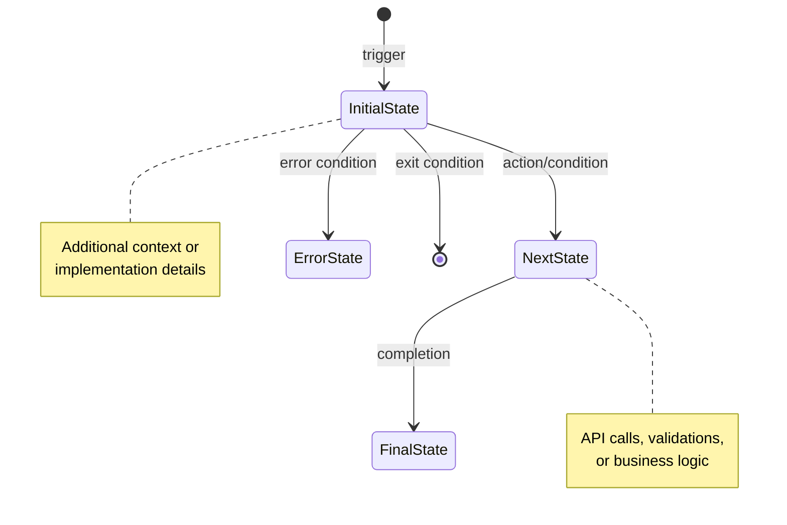

# Diagram Maker

Create state machine diagrams using Mermaid syntax. This forces comprehensive analysis of ALL code paths, preventing lazy AI behavior that skips edge cases and error handling.

## Why State Machines?

1. **Forces complete path mapping** - Must scan ALL if-else branches, switch-case, error states
2. **Prevents lazy "happy path only" thinking** - Must answer: "If in CHECKING state and timeout occurs, where does it go?"
3. **Reveals true system logic** - States are the soul of the system. Wrong state understanding = wrong business logic

## When to Use

- Analyzing existing components with complex state logic
- Verifying AI understands all state transitions correctly
- Finding missing error paths or race conditions
- Before implementing state-heavy features
- Documenting complex multi-step processes

## State Machine Template

## Conventions

- **State names**: PascalCase (e.g., `LoadingData`, `RequestPending`)
- **Separate concerns**: 
  - UI states: `Selecting`, `Loading`, `Entering`
  - Backend states: `Pending`, `Confirmed`, `Completed`
- **Always show error paths**: Timeout, API failure, validation errors
- **Add notes for**:
  - API endpoints: `POST /api/resource`
  - DB mutations: `status="pending"`
  - Race conditions: Double-check logic
  - Validations: Format checks, conflicts
  - Business logic: Conditional flows, auto-actions

## Critical: Map ALL Paths

**Don't be lazy!** For each state, ask:
- ✅ What if API fails?
- ✅ What if timeout?
- ✅ What if validation error?
- ✅ What if user goes back?
- ✅ What if race condition?

If you can't answer = you don't understand the system = read more code.

## Workflow

1. **Read code thoroughly** - Component, API routes, queries
2. **List ALL states** - UI states + DB status values
3. **Map transitions** - Include error paths, not just success
4. **Verify completeness** - Every state must have exit conditions
5. **Add notes** - API calls, validations, business rules